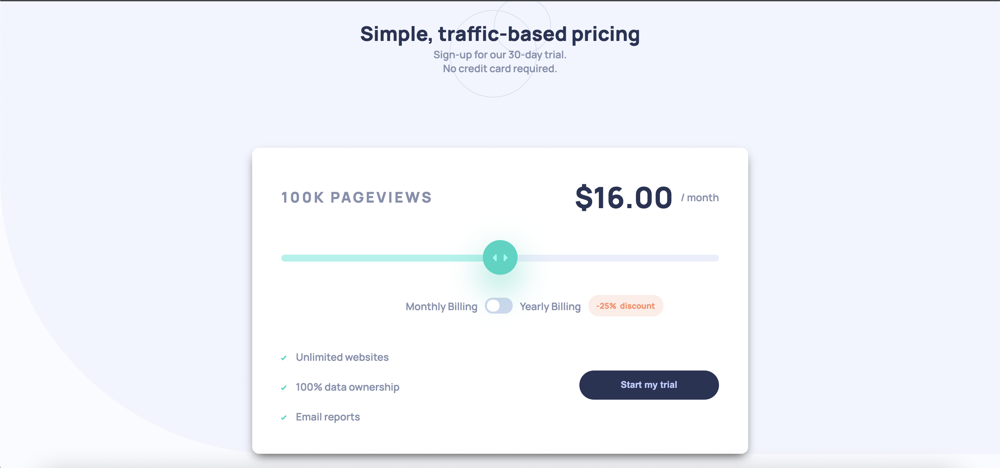

# Frontend Mentor - Interactive pricing component solution

This is a solution to the [Interactive pricing component challenge on Frontend Mentor](https://www.frontendmentor.io/challenges/interactive-pricing-component-t0m8PIyY8). Frontend Mentor challenges help you improve your coding skills by building realistic projects.

## Table of contents

- [Overview](#overview)
  - [The challenge](#the-challenge)
  - [Screenshot](#screenshot)
  - [Links](#links)
- [My process](#my-process)
  - [Built with](#built-with)
  - [What I learned](#what-i-learned)
- [Author](#author)

## Overview

### The challenge

Users should be able to:

- View the optimal layout for the app depending on their device's screen size
- See hover states for all interactive elements on the page
- Use the slider and toggle to see prices for different page view numbers

### Screenshot

### Links

- Solution URL: [Solution on frontendmentor.io](https://www.frontendmentor.io/solutions/responsive-interactive-pricing-component-using-css-grid-flexbox-js-Xa4DLRjdb)
- Live Site URL: [Live demo](https://anuarshaidenov.github.io/interactive-pricing-component/)

## My process

### Built with

- Semantic HTML5 markup
- CSS custom properties
- Flexbox
- CSS Grid
- Vanilla JS

### What I learned

I made use of CSS grid and Flexbox. I also used Vanilla JS for the interactive components.

## Author

- github - [anuarshaidenov](https://github.com/anuarshaidenov)
- Frontend Mentor - [anuarshaidenov](https://www.frontendmentor.io/profile/anuarshaidenov)
- Twitter - [@anuarnyi](https://www.twitter.com/anuarnyi)
- Instagram - [@044anuar](https://www.instagram.com/044anuar)
